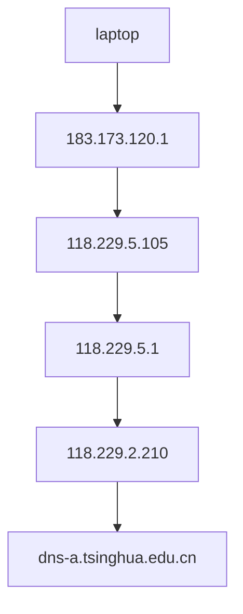

## 计算机网络及应用

**实验一 基本网络操作命令**

祝尔乐 2020013020

### 实验目的

* 练习使用网络常用命令，进一步了解网络地址、子网掩码、域名、网关、路由、地址解析、协议和端口等网络的基本概念;

* 通过查看和测试网络状态，发现和解决网络可能存在的问题。

### 实验环境

* 操作系统：Windows 10

* 网络情况：已连接WLAN

### 实验内容

#### (1)

打开Powershell终端，在命令行中输入`ipconfig`，得到如下结果：

```shell
Windows IP Configuration
...

Wireless LAN adapter WLAN:

   Connection-specific DNS Suffix  . : tsinghua.edu.cn
   Description . . . . . . . . . . . : Intel(R) Wireless-AC 9462
   Physical Address. . . . . . . . . : 9C-FC-E8-42-93-AC
   DHCP Enabled. . . . . . . . . . . : Yes
   Autoconfiguration Enabled . . . . : Yes
   IPv6 Address. . . . . . . . . . . : 2402:f000:3:7801:a9fb:2695:9e70:93d7(Preferred)
   Temporary IPv6 Address. . . . . . : 2402:f000:3:7801:f046:930e:78ed:1029(Preferred)
   Link-local IPv6 Address . . . . . : fe80::a9fb:2695:9e70:93d7%26(Preferred)
   IPv4 Address. . . . . . . . . . . : 183.173.126.123(Preferred)
   Subnet Mask . . . . . . . . . . . : 255.255.248.0
   Lease Obtained. . . . . . . . . . : Monday, September 26, 2022 3:14:23 PM
   Lease Expires . . . . . . . . . . : Monday, September 26, 2022 5:57:18 PM
   Default Gateway . . . . . . . . . : fe80::9629:2fff:fe37:8802%26
                                       183.173.120.1
   DHCP Server . . . . . . . . . . . : 166.111.8.6
   DHCPv6 IAID . . . . . . . . . . . : 345832680
   DHCPv6 Client DUID. . . . . . . . : 00-01-00-01-27-F2-25-10-9C-FC-E8-42-93-AC
   DNS Servers . . . . . . . . . . . : 2402:f000:1:801::8:28
                                       2402:f000:1:801::8:29
                                       166.111.8.28
                                       166.111.8.29
                                       101.7.8.9
   NetBIOS over Tcpip. . . . . . . . : Enabled

...
```

可以看到，本机的IP(v4)地址为：183.173.126.123

子网掩码：255.255.248.0

DNS服务器地址：166.111.8.28；166.111.8.29；101.7.8.9

默认网关地址：183.173.120.1

网卡物理地址为：9C-FC-E8-42-93-AC

#### （2）

通过`nbtstat -n`, 得到本机的netbios信息：

```shell
Node IpAddress: [183.173.126.123] Scope Id: []

                NetBIOS Local Name Table

       Name               Type         Status
    ---------------------------------------------
    WORKGROUP      <00>  GROUP       Registered
    DESKTOP-QV3PI9M<00>  UNIQUE      Registered
    DESKTOP-QV3PI9M<20>  UNIQUE      Registered
```

`nbtstat -c`，查看netbios缓存：

```shell
Node IpAddress: [183.173.126.123] Scope Id: []

    No names in cache
```

表明netbios暂无缓存。

`nbtstat -r`，查看netbios统计信息：

```shell
NetBIOS Names Resolution and Registration Statistics
----------------------------------------------------

Resolved By Broadcast     = 0
Resolved By Name Server   = 0

Registered By Broadcast   = 204
Registered By Name Server = 0


# 相邻计算机
    NetBIOS 名称解析和注册统计
    ----------------------------------------------------

    通过广播解析的     = 0
    通过名称服务器解析   = 0

    通过广播注册的   = 69
    通过名称服务器注册的 = 0
```

可以看到通过Broadcast注册的netbios names有204个。

#### （3）

输入`netstat`，可以看到：

```shell
Active Connections

  Proto  Local Address          Foreign Address        State
  TCP    0.0.0.0:135            DESKTOP-QV3PI9M:0      LISTENING
  TCP    0.0.0.0:445            DESKTOP-QV3PI9M:0      LISTENING
  TCP    0.0.0.0:902            DESKTOP-QV3PI9M:0      LISTENING
  TCP    0.0.0.0:912            DESKTOP-QV3
PI9M:0      LISTENING
  TCP    0.0.0.0:1309           DESKTOP-QV3PI9M:0      LISTENING
  TCP    0.0.0.0:2343           DESKTOP-QV3PI9M:0      LISTENING
  TCP    0.0.0.0:3306           DESKTOP-QV3PI9M:0      LISTENING
  TCP    0.0.0.0:3580           DESKTOP-QV3PI9M:0      LISTENING
  TCP    0.0.0.0:3655           DESKTOP-QV3PI9M:0      LISTENING
  TCP    0.0.0.0:5040           DESKTOP-QV3PI9M:0      LISTENING
  TCP    0.0.0.0:6000           DESKTOP-QV3PI9M:0      LISTENING
  TCP    0.0.0.0:8766           DESKTOP-QV3PI9M:0      LISTENING
  TCP    0.0.0.0:33060          DESKTOP-QV3PI9M:0      LISTENING
  TCP    0.0.0.0:49664          DESKTOP-QV3PI9M:0      LISTENING
  TCP    0.0.0.0:49665          DESKTOP-QV3PI9M:0      LISTENING
  TCP    0.0.0.0:49667          DESKTOP-QV3PI9M:0      LISTENING
  TCP    0.0.0.0:49668          DESKTOP-QV3PI9M:0      LISTENING
  TCP    0.0.0.0:55063          DESKTOP-QV3PI9M:0      LISTENING
  TCP    0.0.0.0:55242          DESKTOP-QV3PI9M:0      LISTENING
  TCP    0.0.0.0:59110          DESKTOP-QV3PI9M:0      LISTENING
  TCP    0.0.0.0:59111          DESKTOP-QV3PI9M:0      LISTENING
  TCP    0.0.0.0:60390          DESKTOP-QV3PI9M:0      LISTENING
  TCP    0.0.0.0:61154          DESKTOP-QV3PI9M:0      LISTENING
  TCP    127.0.0.1:2017         DESKTOP-QV3PI9M:0      LISTENING
  TCP    127.0.0.1:5352         DESKTOP-QV3PI9M:0      LISTENING
  TCP    127.0.0.1:5352         kubernetes:49669       ESTABLISHED
  TCP    127.0.0.1:5352         kubernetes:49682       ESTABLISHED
  TCP    127.0.0.1:5352         kubernetes:49695       ESTABLISHED
  TCP    127.0.0.1:5352         kubernetes:58731       ESTABLISHED
  TCP    127.0.0.1:6000         kubernetes:65493       ESTABLISHED
  TCP    127.0.0.1:6000         kubernetes:65494       ESTABLISHED
  TCP    127.0.0.1:6000         kubernetes:65495       ESTABLISHED
  TCP    127.0.0.1:7890         DESKTOP-QV3PI9M:0      LISTENING
  TCP    127.0.0.1:7890         kubernetes:54448       ESTABLISHED
  TCP    127.0.0.1:7890         kubernetes:55066       ESTABLISHED
  TCP    127.0.0.1:7890         kubernetes:55570       TIME_WAIT
  TCP    127.0.0.1:7890         kubernetes:56746       ESTABLISHED
  TCP    127.0.0.1:7890         kubernetes:62104       ESTABLISHED
  TCP    127.0.0.1:8680         DESKTOP-QV3PI9M:0      LISTENING
  TCP    127.0.0.1:8884         DESKTOP-QV3PI9M:0      LISTENING
  TCP    127.0.0.1:10000        DESKTOP-QV3PI9M:0      LISTENING
  TCP    127.0.0.1:27018        DESKTOP-QV3PI9M:0      LISTENING
  TCP    127.0.0.1:49635        DESKTOP-QV3PI9M:0      LISTENING
  TCP    127.0.0.1:49669        kubernetes:5352        ESTABLISHED
  TCP    127.0.0.1:49682        kubernetes:5352        ESTABLISHED
  TCP    127.0.0.1:49695        kubernetes:5352        ESTABLISHED
  TCP    127.0.0.1:50000        DESKTOP-QV3PI9M:0      LISTENING
  TCP    127.0.0.1:50078        DESKTOP-QV3PI9M:0      LISTENING
  TCP    127.0.0.1:50086        DESKTOP-QV3PI9M:0      LISTENING
  TCP    127.0.0.1:50086        kubernetes:50094       ESTABLISHED
  TCP    127.0.0.1:50086        kubernetes:50096       ESTABLISHED
  TCP    127.0.0.1:50090        DESKTOP-QV3PI9M:0      LISTENING
  TCP    127.0.0.1:50090        kubernetes:50093       ESTABLISHED
  TCP    127.0.0.1:50090        kubernetes:50095       ESTABLISHED
  TCP    127.0.0.1:50093        kubernetes:50090       ESTABLISHED
  TCP    127.0.0.1:50094        kubernetes:50086       ESTABLISHED
  TCP    127.0.0.1:50095        kubernetes:50090       ESTABLISHED
  TCP    127.0.0.1:50096        kubernetes:50086       ESTABLISHED
  TCP    127.0.0.1:53042        kubernetes:53043       ESTABLISHED
  TCP    127.0.0.1:53043        kubernetes:53042       ESTABLISHED
  TCP    127.0.0.1:53044        kubernetes:53045       ESTABLISHED
  TCP    127.0.0.1:53045        kubernetes:53044       ESTABLISHED
  TCP    127.0.0.1:54448        kubernetes:7890        ESTABLISHED
  TCP    127.0.0.1:55066        kubernetes:7890        ESTABLISHED
  TCP    127.0.0.1:55150        kubernetes:7890        TIME_WAIT
  TCP    127.0.0.1:55211        kubernetes:7890        TIME_WAIT
  TCP    127.0.0.1:55226        kubernetes:7890        TIME_WAIT
  TCP    127.0.0.1:55228        kubernetes:7890        TIME_WAIT
  TCP    127.0.0.1:55230        kubernetes:7890        TIME_WAIT
  TCP    127.0.0.1:55231        kubernetes:7890        TIME_WAIT
  TCP    127.0.0.1:55234        kubernetes:7890        TIME_WAIT
  TCP    127.0.0.1:55236        kubernetes:7890        TIME_WAIT
  TCP    127.0.0.1:55780        DESKTOP-QV3PI9M:0      LISTENING
  TCP    127.0.0.1:55780        kubernetes:55210       TIME_WAIT
  TCP    127.0.0.1:55780        kubernetes:62110       TIME_WAIT
  TCP    127.0.0.1:55780        kubernetes:62136       ESTABLISHED
  TCP    127.0.0.1:56746        kubernetes:7890        ESTABLISHED
  TCP    127.0.0.1:58690        kubernetes:58691       ESTABLISHED
  TCP    127.0.0.1:58691        kubernetes:58690       ESTABLISHED
  TCP    127.0.0.1:58731        kubernetes:5352        ESTABLISHED
  TCP    127.0.0.1:60376        DESKTOP-QV3PI9M:0      LISTENING
  TCP    127.0.0.1:60382        DESKTOP-QV3PI9M:0      LISTENING
  TCP    127.0.0.1:60382        kubernetes:60387       ESTABLISHED
  TCP    127.0.0.1:60382        kubernetes:60392       ESTABLISHED
  TCP    127.0.0.1:60382        kubernetes:60393       ESTABLISHED
  TCP    127.0.0.1:60382        kubernetes:60394       ESTABLISHED
  TCP    127.0.0.1:60382        kubernetes:60396       ESTABLISHED
  TCP    127.0.0.1:60387        kubernetes:60382       ESTABLISHED
  TCP    127.0.0.1:60392        kubernetes:60382       ESTABLISHED
  TCP    127.0.0.1:60393        kubernetes:60382       ESTABLISHED
  TCP    127.0.0.1:60394        kubernetes:60382       ESTABLISHED
  TCP    127.0.0.1:60396        kubernetes:60382       ESTABLISHED
  TCP    127.0.0.1:60397        kubernetes:60398       ESTABLISHED
  TCP    127.0.0.1:60398        kubernetes:60397       ESTABLISHED
  TCP    127.0.0.1:60399        kubernetes:60400       ESTABLISHED
  TCP    127.0.0.1:60400        kubernetes:60399       ESTABLISHED
  TCP    127.0.0.1:60978        kubernetes:60979       ESTABLISHED
  TCP    127.0.0.1:60979        kubernetes:60978       ESTABLISHED
  TCP    127.0.0.1:60981        kubernetes:60982       ESTABLISHED
  TCP    127.0.0.1:60982        kubernetes:60981       ESTABLISHED
  TCP    127.0.0.1:60985        kubernetes:60986       ESTABLISHED
  TCP    127.0.0.1:60986        kubernetes:60985       ESTABLISHED
  TCP    127.0.0.1:60995        kubernetes:60996       ESTABLISHED
  TCP    127.0.0.1:60996        kubernetes:60995       ESTABLISHED
  TCP    127.0.0.1:61440        kubernetes:61446       ESTABLISHED
  TCP    127.0.0.1:61445        DESKTOP-QV3PI9M:0      LISTENING
  TCP    127.0.0.1:61446        DESKTOP-QV3PI9M:0      LISTENING
  TCP    127.0.0.1:61446        kubernetes:61440       ESTABLISHED
  TCP    127.0.0.1:62104        kubernetes:7890        ESTABLISHED
  TCP    127.0.0.1:62109        kubernetes:55780       TIME_WAIT
  TCP    127.0.0.1:62124        kubernetes:7890        TIME_WAIT
  TCP    127.0.0.1:62133        kubernetes:7890        TIME_WAIT
  TCP    127.0.0.1:62135        kubernetes:55780       TIME_WAIT
  TCP    127.0.0.1:62136        kubernetes:55780       ESTABLISHED
  TCP    127.0.0.1:64895        kubernetes:7890        TIME_WAIT
  TCP    127.0.0.1:64896        kubernetes:7890        TIME_WAIT
  TCP    127.0.0.1:64900        kubernetes:7890        TIME_WAIT
  TCP    127.0.0.1:65123        DESKTOP-QV3PI9M:0      LISTENING
  TCP    127.0.0.1:65493        kubernetes:6000        ESTABLISHED
  TCP    127.0.0.1:65494        kubernetes:6000        ESTABLISHED
  TCP    127.0.0.1:65495        kubernetes:6000        ESTABLISHED
  TCP    183.173.126.123:139    DESKTOP-QV3PI9M:0      LISTENING
  TCP    183.173.126.123:49438  20.198.162.78:https    ESTABLISHED
  TCP    183.173.126.123:50079  166.111.180.142:ssh    ESTABLISHED
  TCP    183.173.126.123:50087  166.111.180.142:ssh    ESTABLISHED
  TCP    183.173.126.123:54449  47.94.21.120:https     ESTABLISHED
  TCP    183.173.126.123:55061  59.111.239.36:https    CLOSE_WAIT
  TCP    183.173.126.123:55064  59.111.209.28:8080     ESTABLISHED
  TCP    183.173.126.123:55069  20.197.71.89:https     ESTABLISHED
  TCP    183.173.126.123:55149  59.111.19.33:https     TIME_WAIT
  TCP    183.173.126.123:55151  47.94.21.120:https     TIME_WAIT
  TCP    183.173.126.123:55212  223.166.80.236:35001   TIME_WAIT
  TCP    183.173.126.123:55227  223.166.80.236:35001   TIME_WAIT
  TCP    183.173.126.123:55229  223.166.80.236:35001   TIME_WAIT
  TCP    183.173.126.123:55235  223.166.80.236:35001   TIME_WAIT

# 相邻计算机
  TCP    127.0.0.1:8588         LAPTOP-RDKJJTGM:51639  ESTABLISHED
  TCP    127.0.0.1:8588         LAPTOP-RDKJJTGM:52393  ESTABLISHED
  TCP    127.0.0.1:51639        LAPTOP-RDKJJTGM:8588   ESTABLISHED
  TCP    127.0.0.1:51981        LAPTOP-RDKJJTGM:51980  TIME_WAIT
  TCP    127.0.0.1:51986        LAPTOP-RDKJJTGM:51985  TIME_WAIT
  TCP    127.0.0.1:52393        LAPTOP-RDKJJTGM:8588   ESTABLISHED
  TCP    127.0.0.1:52443        LAPTOP-RDKJJTGM:52444  ESTABLISHED
  TCP    127.0.0.1:52444        LAPTOP-RDKJJTGM:52443  ESTABLISHED
  TCP    127.0.0.1:52445        LAPTOP-RDKJJTGM:52446  ESTABLISHED
  TCP    127.0.0.1:52446        LAPTOP-RDKJJTGM:52445  ESTABLISHED 

......
```

可以看到本机所有的传输层协议的统计信息和协议的端口，可以看到本机所有的连接都是基于TCP协议的，且连接的状态有listening, time_wait, established三种状态。

#### （4）

通过`arp -a`测试ip地址与物理地址的转换。

```shell
Interface: 183.173.126.123 --- 0x1a
 Internet Address Physical Address Type
 183.173.120.1 94-29-2f-37-88-02 dynamic
 183.173.127.255 ff-ff-ff-ff-ff-ff static
 224.0.0.22 01-00-5e-00-00-16 static
 224.0.0.251 01-00-5e-00-00-fb static
 224.0.0.252 01-00-5e-00-00-fc static
 230.0.0.1 01-00-5e-00-00-01 static
 239.255.255.250 01-00-5e-7f-ff-fa static
 255.255.255.255 ff-ff-ff-ff-ff-ff static
```

#### （5）

使用`ping`测试网络的连通性

```shell
# 测试本机TCP
>ping 127.0.0.1
Pinging 127.0.0.1 with 32 bytes of data:
Reply from 127.0.0.1: bytes=32 time<1ms TTL=128
Reply from 127.0.0.1: bytes=32 time<1ms TTL=128
Reply from 127.0.0.1: bytes=32 time<1ms TTL=128
Reply from 127.0.0.1: bytes=32 time<1ms TTL=128

Pig# statistics for 127.0.0.1:
    Packets: Sent = 4, Received = 4, Lost = 0 (0% loss),
Approximate round trip times in milli-seconds:
    Minimum = 0ms, Maximum = 0ms, Average = 0ms


# 测试本机IP
Pinging 183.173.126.123 with 32 bytes of data:
Reply from 183.173.126.123: bytes=32 time<1ms TTL=128
Reply from 183.173.126.123: bytes=32 time<1ms TTL=128
Reply from 183.173.126.123: bytes=32 time<1ms TTL=128
Reply from 183.173.126.123: bytes=32 time<1ms TTL=128

Ping statistics for 183.173.126.123:
    Packets: Sent = 4, Received = 4, Lost = 0 (0% loss),
Approximate round trip times in milli-seconds:
    Minimum = 0ms, Maximum = 0ms, Average = 0ms 

# 测试网关
Pinging 183.173.120.1 with 32 bytes of data:
Reply from 183.173.120.1: bytes=32 time=18ms TTL=255
Reply from 183.173.120.1: bytes=32 time=21ms TTL=255
Reply from 183.173.120.1: bytes=32 time=22ms TTL=255
Reply from 183.173.120.1: bytes=32 time=21ms TTL=255

Ping statistics for 183.173.120.1:
    Packets: Sent = 4, Received = 4, Lost = 0 (0% loss),
Approximate round trip times in milli-seconds:
    Minimum = 18ms, Maximum = 22ms, Average = 20ms 

# 相邻计算机
Pinging 183.173.245.21 with 32 bytes of data:
Request timed out.
age = 7ms
```

ping 命令通过向计算机发送ICMP回应报文并且监听回应报文的返回,以校验与远程计算机或本地计算机的连接。可以看出以上域名都与本机建立了连接。

#### （6）

通过tracert查看本机到166.111.8.28所经过的路由器的IP地址。结果如下：

```shell
Tracing route to dns-a.tsinghua.edu.cn [166.111.8.28]
over a maximum of 30 hops:

  1    26 ms    13 ms     *     183.173.120.1
  2    27 ms    14 ms    12 ms  118.229.5.105
  3    23 ms    14 ms    49 ms  118.229.5.1
  4    22 ms    13 ms    19 ms  118.229.2.210
  5    18 ms    17 ms    22 ms  dns-a.tsinghua.edu.cn [166.111.8.28]

Trace complete.  
```

### 实验思考

#### （1）

主机必须要包含的基本网络配置有： IP地址，
子网掩码，DNS服务器，网关

必须要有的地址：IP地址，
子网掩码地址，DNS服务器地址，默认网关地址，网卡物理地址；

#### （2）

不可以。

通过查阅资料，诊断工具tracert通过向目标发送具有变化的“生存时间 (TTL) ”值的“ ICMP 回响请求”消息来确定到达目标的路径。要求路径上的每个路由器在转发数据包之前至少将 IP 数据包中的 TTL 递减 1。这样，TTL 就成为最大链路计数器。数据包上的 TTL 到达 0 时，路由器应该将“ICMP 已超时”的消息发送回源计算机。Tracert 发送 TTL 为 1 的第一条“回响请求”消息，并在随后的每次发送过程将 TTL 递增 1，直到目标响应或跃点达到某个设定的最大值，从而确定路径。但是，某些路由器不会为其 TTL 值已过期的数据包返回“已超时”消息，而且这些路由器对于 tracert 命令不可见。在这种情况下，将为该跃点显示一行星号 ，所以，不能判断该路由不可到达。

#### （3）

两种命令运行的结果

```shell
# ping 
Pinging 166.111.8.28 with 32 bytes of data:
Reply from 166.111.8.28: bytes=32 time=35ms TTL=60
Reply from 166.111.8.28: bytes=32 time=31ms TTL=60
Reply from 166.111.8.28: bytes=32 time=17ms TTL=60
Reply from 166.111.8.28: bytes=32 time=32ms TTL=60

Ping statistics for 166.111.8.28:
    Packets: Sent = 4, Received = 4, Lost = 0 (0% loss),
Approximate round trip times in milli-seconds:
    Minimum = 17ms, Maximum = 35ms, Average = 28ms

# tracert
  1    25 ms    15 ms    16 ms  183.173.120.1
  2    14 ms    27 ms    16 ms  118.229.5.105
  3    24 ms    42 ms    12 ms  118.229.5.1
  4    26 ms    29 ms    18 ms  118.229.2.210
  5    19 ms    18 ms    25 ms  dns-a.tsinghua.edu.cn [166.111.8.28]
```

可以看出两条指令运行后经过的路由不同（why? (4))。
画出路由路线图（由tracert）



#### （4）

在进行实验中，我对`ping -r`和`tracert`两种命令产生的路由不同感到困惑，但仔细思考，`ping -r`根据返回包的记录的源地址选项来实现路由记录的，其记录的路由是目标地址到本机地址的路由；tracert 是通过递增TTL来实现的路由检测，检测到的路由是本机到目标主机的路由。数据来去传输的路由很有可能是不同的，因此两种方法得到不同的路由也可以理解。
