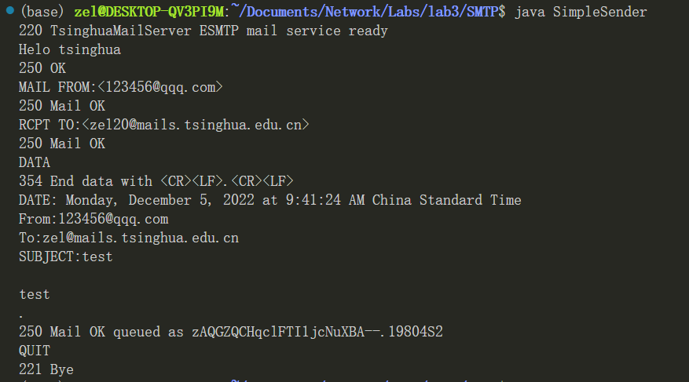
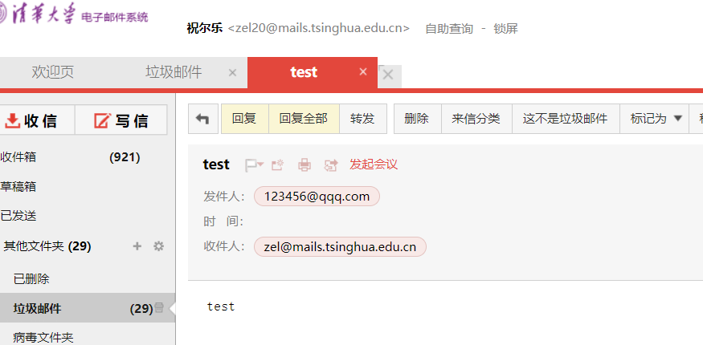
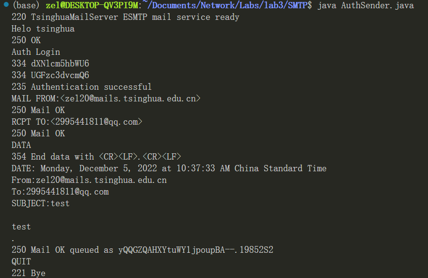
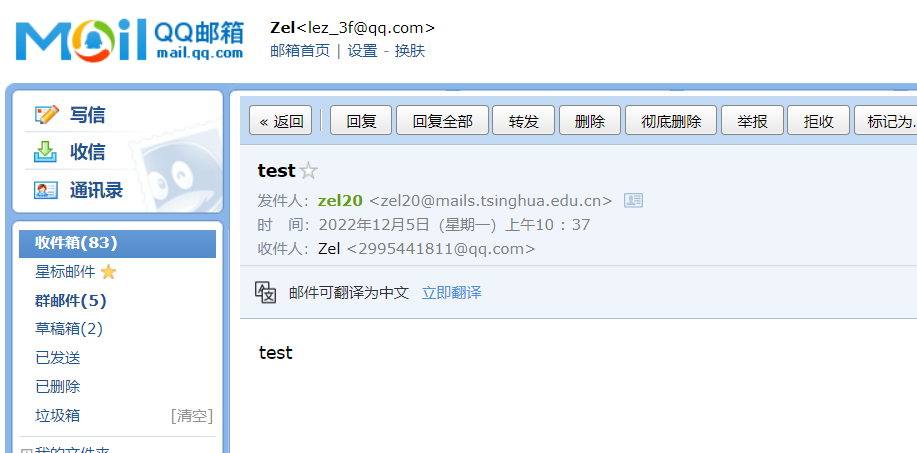
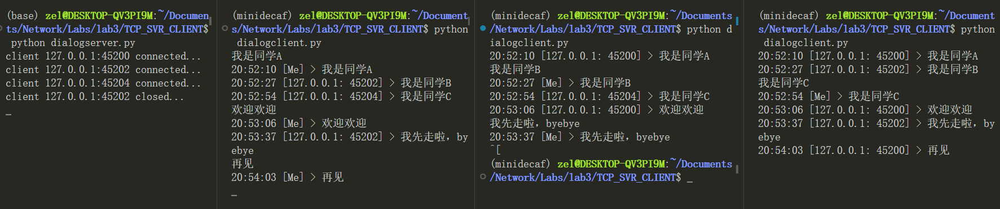

**计算机网络及应用实验**

## **实验三 Socket编程实现网络通信**

祝尔乐 2020013020

### 1. 实验目的

- 掌握 Socket 编程思想，并实现简单的 Socket 应用的连接通信过程
- 复习SMTP, HTTPS等应用层协议

### 2. 实验环境
- 操作系统: Windows Subsystem for Linux (Ubuntu20.04)
- java version: openjdk 11.0.15 2022-04-19
- python version: 3.9.13

### 3. 实验内容与结果

#### 3.1 不带服务器身份验证的邮件发送客户端实验

根据TODO提示和实验测试完成代码，选择发送至邮箱"zel20@mails.tsinghua.edu.cn"。
运行'javac SimpleSender.java & java SimpleSender'，可以得到输出结果：

打开清华邮箱，可以看到邮件已经收到。

#### 3.2 带服务器身份验证的邮件发送客户端实验
根据TODO提示和实验测试完成代码，实现了从本人的清华邮箱账号(zel20@mails.tsinghua.edu.cn)到我的qq邮箱('2995441811@qq.com')的
带身份验证的邮件发送。

运行'javac AuthSender.java & java AuthSender'，可以得到输出结果：

打开qq邮箱，可以看到邮件已经收到。

#### 3.3 通过 `socket` 收发信息的客户端和服务器端程序

本部分基于linux的`select.epoll`和python的框架，实现了一个异步非阻塞的多客户端的服务器`dialogserver`，该服务器可以与多个`dialogclient`建立连接并实现将client发送的消息转发给所有子client的功能。具体代码位于`TCP_SVR_CLIENT/dialogclient.py`，`TCP_SVR_CLIENT/dialogserver.py`
中。

实现效果如下：

- 运行`python dialogserver.py/dialogclient.py`启动服务器/客户端
- 可启用多个客户端，客户端会与服务器连接，并且epoll会对所有连接的客户端进行注册，如果客户端断开连接，epoll会进行注销，并且并不会影响服务器正常功能
- 任意个客户端发送消息，所有客户端都会接收到消息，并且会显示发送者的ip和port，如果自己发的会显示"Me"。

效果图片：

### 4. 思考分析

#### 4.1 Simple SMTP 和常用的 E-mail 客户端比

- Simple SMTP没有身份验证，任何人用相同的代码都可以用该“账户”发送邮件，但由于ip并不是官方邮箱的ip，最终邮件会接收者客户端放进垃圾箱。

- 常用的E-MAil客户端由于需要身份验证，所以在发送的邮件SMTP需要多执行"Auth login"指令。

#### 4.2 使用 TCP 和 UDP 优缺点比较

- TCP是基于连接的数据传输，而UDP是无连接的数据传输。TCP需要三次握手建立连接，同时需要维护连接相关的资源，UDP无需建立连接，结构更为简单，也无需维护连接相关的资源

- TCP是可靠的数据传输，保证数据正确性，但是时延较大，消耗资源较高；UDP是不可靠的数据传输，可能丢包，不保证数据正确性，时延较低，传输较快

- 分组首部不同，TCP开销更大

#### 4.3 实验体会

本实验过程遇到了一些问题和解决方法：

- SMTP的一些状态码不知道如何填写，解决方法：运行程序，根据输出修改状态码

- 客户端实现非阻塞接收标准输入遇到困难，弃用`input()`，改用`loop-check`的形式对输入流进行检测，当输入发生变化，才会接收数据;
同时在接收服务器的消息时，也需要采用非阻塞接收，可以通`clientsocket.setblocking(0)`来使得`recv()`是非阻塞的。
- 服务器实现先是参照教程进行编写，但是对各个函数的意义不明确，在阅读了`select`的文档后我了解了每行代码的含义，并进行了改进使得程序更为的鲁棒。